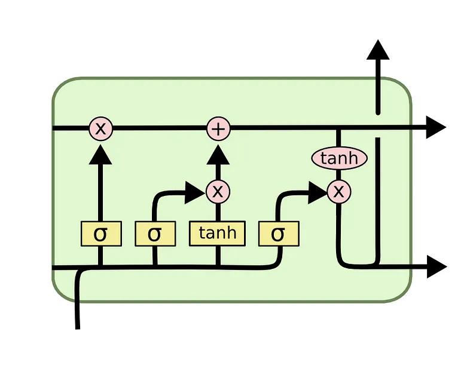

<!-- PROJECT LOGO -->

    <h3 align="center">When to invest in Polish stock?  Could we predict market moves with LSTM network?</h3>
    
    

        <a href="https://github.com/MarcinLinkl/stock_market_analysis"><strong>Explore the docs »</strong></a>
         
         
        <a href="https://github.com/MarcinLinkl/stock_market_analysis/issues">Report Bug</a>
    

<!-- Project Description -->

## Project Description

Welcome to our research project, where we delve into the intriguing world of the Polish stock market. Our goal is to explore the possibility of predicting market movements using Long Short-Term Memory (LSTM) networks, a cutting-edge tool in the field of machine learning and artificial intelligence.

### Key Aspects of the Project:

1. **Data Analysis**: We perform in-depth data analysis using Python, leveraging powerful libraries like pandas, to gain insights into historical stock market trends.

2. **Linear Regression and Plotly**: We use linear regression to identify potential relationships in the data and visualize these relationships using Plotly, creating interactive correlation matrices for a deeper understanding.

3. **LSTM Predictions**: We apply LSTM networks to investigate the feasibility of predicting stock market movements. This includes one-day predictions and forecasting sequences of days ahead, with a focus on the Polish stock market.

This project aims to shed light on whether it's possible to make informed investment decisions in the dynamic world of stock trading, utilizing advanced programming techniques.

### Project Notebooks:

- [Python analysis with pandas, linear regression, plotly correlation matrix, day/week/month distributions](https://github.com/MarcinLinkl/stock_market_analysis/blob/master/1_-wig20_analyse.ipynb)
- [LSTM one-day prediction check out](https://github.com/MarcinLinkl/stock_market_analysis/blob/master/2-_lstm_model.ipynb)
- [LSTM sequence days ahead forecasting](https://github.com/MarcinLinkl/stock_market_analysis/blob/master/3_-lstm-x-day-ahead.ipynb)

<!-- ABOUT THE PROJECT -->

(<a href="#readme-top">back to top</a>)

## About The Project

It's crucial to remember that investing in the stock market is subject to various risks. Before making any investment decisions, it's essential to conduct thorough research, consider your financial goals, and assess your risk tolerance. Diversifying your portfolio and seeking advice from financial experts can be valuable in managing these risks.

(<a href="#readme-top">back to top</a>)

<!-- CONTACT -->

## Contact

I'm currently seeking new job opportunities, so please feel free to get in touch with any inquiries or collaborations at linkiel.marcin@gmail.com.

Project Link: [https://github.com/MarcinLinkl/stock_market_analysis](https://github.com/MarcinLinkl/stock_market_analysis)

(<a href="#readme-top">back to top</a>)

